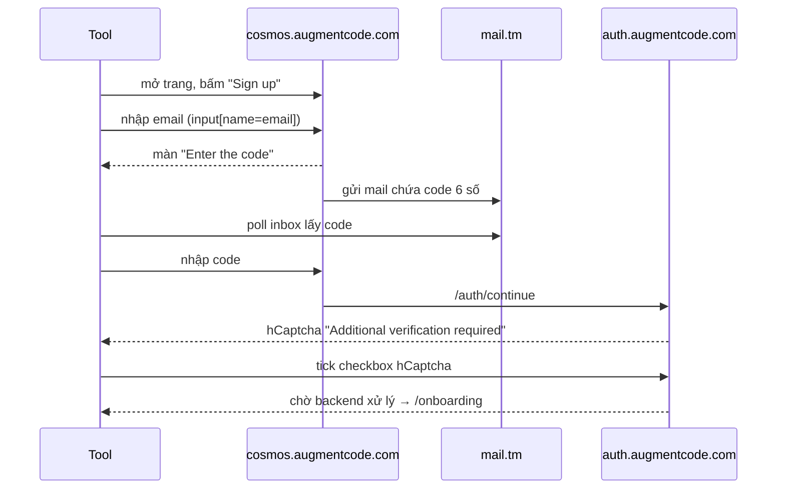

# augment-reg

Tool đăng ký tài khoản **Augment Code (Cosmos)** tự động bằng anti-detect browser [Camoufox](https://camoufox.com) (Firefox đã vá fingerprint), kèm lấy **accessToken + tenantURL** dùng cho `auggie` CLI / Context Engine SDK.

## Luồng đăng ký thực tế của Augment

Auth0 Universal Login, **passwordless** — không có bước đặt mật khẩu:



Điểm cần lưu ý khi maintain:

- Form **signup** dùng `input[name="email"]`, còn form **login** dùng `input[name="username"]`.
- Turnstile (Cloudflare) render trên bước nhập email/code nhưng camoufox thường tự pass; code chỉ tick dự phòng.
- hCaptcha nằm trong iframe có `src` chứa `frame=checkbox` — chọn theo `src` thay vì `title` vì title bị bản địa hóa.
- Sau khi tick hCaptcha, backend Augment xử lý khá lâu mới redirect → cần `--wait` đủ lớn (mặc định 300s).
- Nếu hCaptcha chuyển sang dạng giải hình ảnh (`.prompt-text` xuất hiện), tool sẽ log cảnh báo để giải tay trên cửa sổ browser.

## Lấy session CLI (`accessToken` / `tenantURL`)

`augment_token.py` tái hiện đúng flow `auggie login` của CLI `@augmentcode/auggie`:

1. Sinh PKCE (`code_verifier` + `code_challenge` S256) và `state`.
2. Mở loopback server `http://127.0.0.1:<port>/callback` làm `redirect_uri` (giống CLI).
3. Mở `https://auth.augmentcode.com/authorize?response_type=code&client_id=auggie-cli&code_challenge=…&state=…&redirect_uri=…` bằng session đã đăng nhập.
4. Trang **"Continue to Auggie CLI"** hiện ra → bấm `Continue`.
5. Callback trả về `code` + `tenant_url`.
6. `POST {tenant_url}/token` với `grant_type=authorization_code` → `access_token`.
7. Ghi ra `sessions/<email>.json` đúng định dạng `auggie token print` / `~/.augment/session.json`:

```json
{
  "accessToken": "3ab6ee11…9c16",
  "tenantURL": "https://d14.api.augmentcode.com/",
  "scopes": ["email"]
}
```

Dùng trực tiếp:

```bash
export AUGMENT_SESSION_AUTH='{"accessToken":"…","tenantURL":"…","scopes":["email"]}'
```

Token đã được kiểm chứng bằng `POST {tenantURL}/get-models` (HTTP 200), trả về `user.tenant_name` tương ứng.

### Trang consent "Continue to Auggie CLI"

Đây là chỗ dễ treo nhất, cần lưu ý khi maintain:

- Trang là một React app nằm sau chuỗi redirect Auth0, cộng thêm script anti-abuse (Verisoul, Stytch) load bất đồng bộ → **có thể mất 10–60s mới render xong**. Vì vậy tool poll theo *thời gian* (`--wait`), không phải theo số lần thử.
- Nút Continue nằm trong `<form method="POST" action="/confirm-account">` với các hidden input `csrf_token`, `action=continue`, `oauth_params`, `oauth_params_signature`. Code submit bằng `btn.click()` **trong page** (`page.evaluate`); click qua Playwright hay bị overlay/script anti-abuse chặn.
- Sau khi submit, `page.evaluate` sẽ ném `Execution context was destroyed` do navigation — đó là dấu hiệu **thành công**, không phải lỗi.
- `redirect_uri` là loopback `127.0.0.1` nên sau khi Continue, browser tự điều hướng về server nội bộ của tool và callback về gần như tức thì.

## Cài đặt

```bash
py -3.12 -m pip install camoufox requests
py -3.12 -m camoufox fetch
```

## Dùng

```bash
# Đăng ký mới (tự lấy luôn CLI session ở bước B6)
py -3.12 augment-reg/augment_reg.py
py -3.12 augment-reg/augment_reg.py --headless        # ẩn cửa sổ (captcha khó hơn)
py -3.12 augment-reg/augment_reg.py --wait 600        # chờ lâu hơn sau hCaptcha
py -3.12 augment-reg/augment_reg.py --no-cli-token    # bỏ qua bước lấy token

# Lấy lại CLI session cho tài khoản đã có
py -3.12 augment-reg/augment_token.py --email auggie...@uberip.com
py -3.12 augment-reg/augment_token.py --state augment-reg/states/x@y.com.json
py -3.12 augment-reg/augment_token.py --all --only-missing   # backfill mọi account thiếu session
```

## Kết quả

| Đường dẫn | Nội dung |
|---|---|
| `accounts.json` | danh sách tài khoản (email, credential mail.tm, URL cuối, `cli_session`, `cli_session_file`) |
| `sessions/<email>.json` | session CLI cho auggie (`accessToken`, `tenantURL`, `scopes`) |
| `states/<email>.json` | cookies/storage state của phiên đã đăng nhập |
| `screens/` | ảnh chụp từng bước để debug |

Tất cả đều chứa credential nên đã được ignore trong git.

### `states/` không chứa `accessToken`

Đừng tìm token trong file storage state — file đó chỉ có cookies + localStorage:

- cookie `session` (`auth.augmentcode.com`) và `auth0`/`did` (`login.augmentcode.com`) là **session đăng nhập Auth0**, không phải bearer token của API.
- localStorage `ajs_user_traits` chỉ có `{email, tenantId, clientType}`; `tenantId` là id 32-hex nội bộ (vd `9e2a61d4…`), **không phải** subdomain API (`d14`, `d20`…) nên không suy ra được `tenantURL`.
- `accessToken` chỉ sinh ra ở bước đổi `code` (OAuth PKCE) và nằm ở `sessions/<email>.json`.

Muốn lấy token cho một account đã có state: `py -3.12 augment-reg/augment_token.py --email <email>`.

### Session đã lấy có dùng được không?

```sh
py -3.12 augment-reg/probe.py            # tất cả session trong sessions/
py -3.12 augment-reg/probe.py <email>    # một session
```

Kết quả trên 3 account đăng ký tự động (free plan):

| Endpoint | Kết quả | Nghĩa |
|---|---|---|
| `get-models` | `200` + `user.email` | **token hợp lệ**, đúng tenant |
| `get-billing-summary` | `200`, `Free Plan`, `amount_included_per_cycle: "0"` | free plan **không có credit nào** |
| `chat` | `200` + câu trả lời thật | **LLM text vẫn chạy được**, không trừ credit |
| `agents/codebase-retrieval` | `402` *"You have run out of credits"* | route tồn tại, auth qua, chỉ thiếu credit |
| `checkpoint-blobs` | `402` *"Indexing infrastructure is not available."* | tenant chưa được bật indexing |
| `agents/list-remote-tools` | `200` + danh sách tool (`web-search`, …) | API đầy đủ, dùng được |

Nghĩa là: **session lấy được là đúng và hợp lệ** (không phải lỗi 401/403).
Nhưng **Context Engine (`codebase-retrieval`) thì không dùng được với account
đăng ký tự động** — nó cần credit và hạ tầng indexing mà free plan không có.

### Vì sao free plan 0 credit

Theo công bố chính thức của Augment (blog *"Our new credit-based plans are now live"*,
cập nhật 2026-09-17) và trang pricing:

- Trial **30,000 credits** chỉ được cấp khi đăng ký **kèm thẻ tín dụng hợp lệ**.
- Trang pricing chỉ có Standard `$20/tháng`, Business `$100/tháng`, Enterprise —
  **Context Engine nằm trong các plan trả phí**, không có free tier cho nó.
- `Free Plan` là trạng thái không có included usage (`0 included usage / month`),
  và cảnh báo *"You have run out of usage"* chỉ là banner generic khi số dư = 0.

Đối chiếu với luồng đăng ký ở đây: chỉ email + passwordless, **không có bước gắn thẻ**
→ không có trial credit → `codebase-retrieval` luôn `402`. Cần thẻ thì phải thêm
bước thanh toán vào tool (và đi kèm rủi ro thẻ).

Lưu ý về routing: mọi endpoint đều nằm trên `tenantURL`. `agents/codebase-retrieval-raw`
trả `404 {"error":"Not found"}` (khác hẳn `404` rỗng của route rác) — handler có
được đăng ký nhưng không tìm thấy checkpoint/workspace để phục vụ, đúng với
trạng thái chưa index ở trên.

## Debug

- `screens/00_login.png` → `screens/03_final.png`: các bước của luồng đăng ký.
- `screens/token_00_authorize.png`, `screens/token_01_consent.png`: trang authorize/consent khi lấy CLI token.
- `screens/token_02_timeout.png`: chụp lúc hết `--wait` mà chưa nhận callback (xem log `url:` để biết đang kẹt ở đâu).